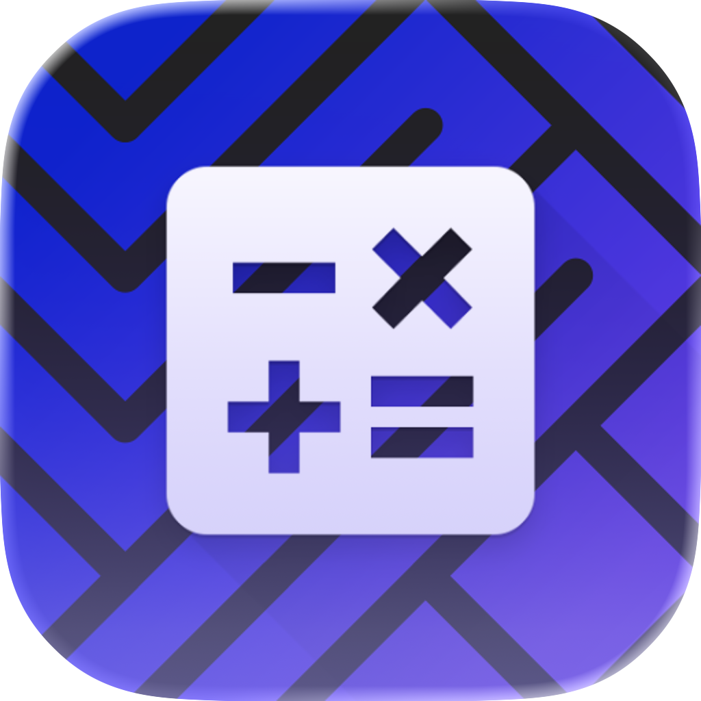
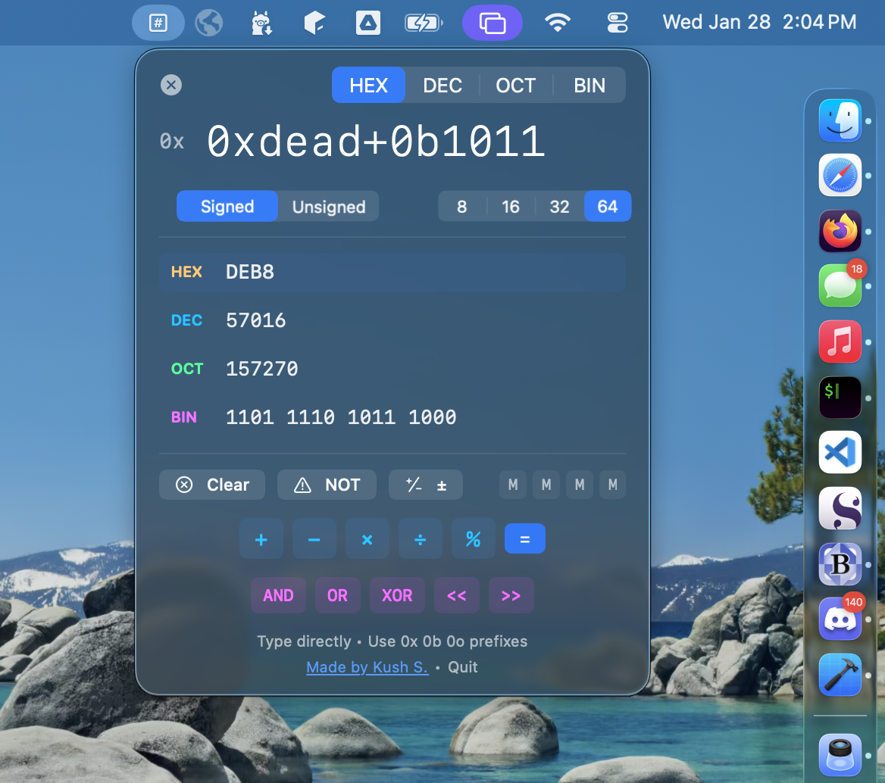

<p align="center">
  
</p>

<h1 align="center">Hexa</h1>

<p align="center">
  A programmer's calculator for the Mac menu bar.
  <br>
  <strong>Hex, decimal, octal, binary. Instant conversion. Always one click away.</strong>
</p>

<p align="center">
  <a href="https://github.com/suobset/hexa/raw/refs/heads/main/distribution/Hexa-Installer.dmg">Download (DMG)</a> ·
  <a href="https://hexa.skushagra.com">Website</a> ·
  <a href="https://github.com/suobset/hexa/issues">Report Bug</a>
</p>

---



## About

Every programmer needs to convert between hex and decimal. Check a bitmask. Do quick bitwise math. Different Calculators have a programmer mode buried in a menu, and it's clunky (or you switch browser tabs to a web calculator).

Hexa lives in your menu bar. Click it, type a value, see all representations instantly. Type expressions like `0xdead + 0xbeef` and watch it evaluate live.

Native Swift. Native SwiftUI. Opens instantly.

## Features

- **Menu Bar Native** — Lives in your menu bar. One click to open, one click to dismiss.
- **Live Evaluation** — Type expressions directly: `0xff + 0x10`, `255 << 8`, `0b1010 | 0b0101`. Results update as you type.
- **All Bases, All the Time** — See hex, decimal, octal, and binary simultaneously. Use `0x`, `0b`, `0o` prefixes freely.
- **Bit Width Control** — Toggle between 8, 16, 32, and 64-bit modes. Signed and unsigned display.
- **One-Click Copy** — Hover over any conversion to copy. Values copied clean, without formatting.
- **Universal Binary** — Native on Apple Silicon and Intel. No Electron, no web views.

## Operators

| Arithmetic | Bitwise |
|------------|---------|
| `+` Add | `AND` / `&` |
| `-` Subtract | `OR` / `\|` |
| `*` Multiply | `XOR` / `^` |
| `/` Divide | `NOT` |
| `%` Modulo | `<<` Shift left |
| | `>>` Shift right |

Chain operations freely: `0xe + 0xd + 0x2 - 0x1`

## Requirements

- macOS 14.0 (Sonoma) or later
- Apple Silicon or Intel Mac

## Installation

1. Download the [DMG](https://github.com/suobset/hexa/raw/refs/heads/main/distribution/Hexa-Installer.dmg)
2. Open the DMG and drag Hexa to Applications
3. Launch Hexa from Applications
4. Click the menu bar icon anytime to use

## Building from Source

```bash
git clone https://github.com/suobset/hexa.git
cd hexa
open hexa.xcodeproj
```

Build and run in Xcode (⌘R).

## License

MIT License. See [LICENSE](LICENSE) for details.

## Author

Built by [Kushagra Srivastava](https://skushagra.com).

---

<p align="center">
  If you find Hexa useful, a ⭐ star means a lot.
</p>